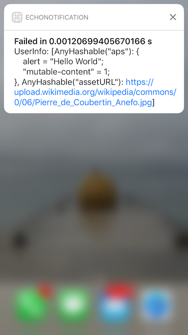

# EchoNotification

iOS push notification example


# Apple push certificate

Create a push certificate on the [Apple developer site](https://developer.apple.com).


# Server certificate

Create a p12 server certificate with keychain.


# AWS Simple Notification Service

Upload credentials to [AWS Simple Notification Service](https://aws.amazon.com/sns/).


Create an Application and register your device as an endpoint.


Sample push payload
```
{
  "APNS_SANDBOX": "{\"aps\":{\"alert\":\"Hello World\"}}"
}
```

Sample push payload with image
```
{
    "APNS_SANDBOX": "{\"aps\":{\"alert\":\"Hello World\",\”mutable-content\":1},\"assetURL\":\"https://upload.wikimedia.org/wikipedia/commons/0/06/Pierre_de_Coubertin_Anefo.jpg\"}"
}
```

# Testing

Test media URLs


Successful rich notification


Failure notification


